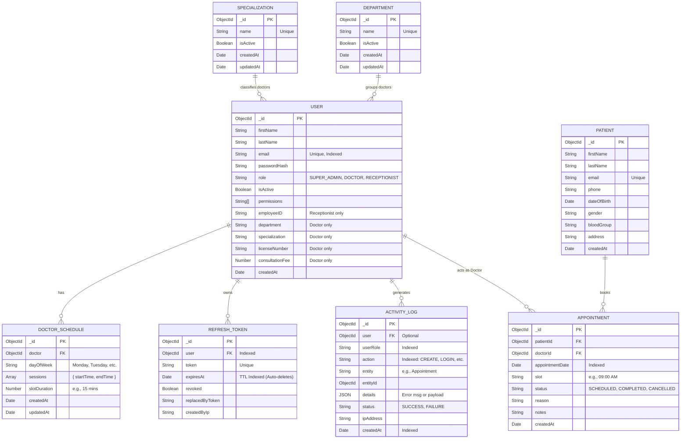

# AdamFin Database Schema

AdamFin utilizes MongoDB, a NoSQL document database. While MongoDB is schema-less by nature, Mongoose is used to strictly enforce the following relational schema at the application level.

## Entity-Relationship (ER) Diagram

Below is a visualization of the database structure and relationships.

## Schema Highlights & Design Choices

1. **Polymorphic `User` Collection**:
   - Instead of splitting staff into `Doctors`, `Receptionists`, and `SuperAdmins` collections, they are unified under one `User` collection using a `role` discriminator. 
   - *Why?* It drastically simplifies the authentication flow, allowing a single `/login` endpoint to securely handle all staff without executing multiple database lookups.

2. **Database-Enforced Double Booking Prevention**:
   - The `APPOINTMENT` collection features a **Compound Unique Index** on `{ doctorId: 1, appointmentDate: 1, slot: 1 }`.
   - *Why?* Even if the application servers suffer a race condition, the database strictly prevents two appointments from occupying the exact same slot for the same doctor on the same day.

3. **Time-To-Live (TTL) Garbage Collection**:
   - The `REFRESH_TOKEN` collection contains a TTL index on `expiresAt`.
   - *Why?* It offloads the cleanup of expired sessions to the MongoDB background worker, preventing infinite collection growth without requiring custom cron jobs.

4. **Audit Trail Optimiziation**:
   - The `ACTIVITY_LOG` collection has compound indexing on `userRole` and `createdAt`.
   - *Why?* This ensures that the high-frequency queries made by the Super Admin dashboard (which filters logs by role and sorts by most recent) remain extremely fast even as the table grows to millions of rows.
